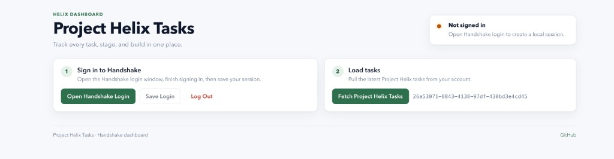

# Project Helix Tasks

A small local web app that signs you into Handshake (in a real browser window)
and shows your **Project Helix** tasks in a clean, filterable dashboard.

Each teammate runs it on their **own laptop** with their **own Handshake login**.
No data leaves your machine; nothing is hosted.



---

## What you need (one-time setup)

1. **Node.js 18 or newer**
   - Check: `node -v`
   - Install from [nodejs.org](https://nodejs.org) if you don't have it.

2. **Git** (to clone the repo)
   - Check: `git --version`

That's it. macOS, Windows, and Linux all work.

---

## First-time setup

Open a terminal and run these four commands, one at a time:

```bash
# 1. Clone the repo
git clone https://github.com/Rhy-Shah/helix-task-dashboard.git
cd helix-task-dashboard

# 2. Install Node dependencies
npm install

# 3. Install the browser used for the Handshake login window
npx playwright install chromium

# 4. Start the local web app
npm start
```

You should see:

```
Project Helix Tasks running at http://localhost:4173 (development mode)
```

Open **<http://localhost:4173>** in your browser.

---

## Using the dashboard

The app has two steps:

### Step 1 — Sign in to Handshake

1. Click **Open Handshake Login**.
   A new Chromium window opens on the Handshake page.
2. Sign in normally (SSO / Duo / whatever your school requires).
   Wait until you see the Project Helix tasks page in that window.
3. Come back to **<http://localhost:4173>** and click **Save Login**.

That stores your session **in memory only** (it's gone when you stop the server).

### Step 2 — Load your tasks

Click **Fetch Project Helix Tasks**. The dashboard fills in.

You can:

- Click the **Total / Delivered & Ready / Internal Audit / Pass@ / Other** cards
  to filter the table.
- Use the **search, stage, and build** filters for finer slicing.
- Click **Copy Filtered IDs** to copy every visible task ID to your clipboard
  (one per line, ready to paste into a spreadsheet).
- Click **Log Out** to wipe your session.

---

## Daily use

After the one-time setup, you only need:

```bash
cd helix-task-dashboard
npm start
```

Then open <http://localhost:4173>. Sign in once per session.

To stop the app: press `Ctrl + C` in the terminal.

---

## Troubleshooting

### "Playwright is not installed" or `Executable doesn't exist`

Run:

```bash
npm install
npx playwright install chromium
```

### macOS: the login window flashes and closes immediately

macOS Gatekeeper has quarantined the Chromium binary. Clear it once:

```bash
xattr -dr com.apple.quarantine ~/Library/Caches/ms-playwright
```

Then click **Open Handshake Login** again.

### macOS: login window crashes with `SIGABRT` / `Operation not permitted` / `chrome-mac-x64`

You are running `npm start` from inside an IDE-sandboxed terminal (e.g. Cursor's
built-in terminal), which uses a separate Playwright cache with the wrong CPU
architecture. **Run `npm start` from the regular macOS Terminal app (or iTerm)
instead** — not from an IDE-integrated terminal — so Playwright uses your real
`~/Library/Caches/ms-playwright/` cache.

### `Error: listen EADDRINUSE: address already in use :::4173`

Another copy of the server is still running. Stop it:

```bash
# macOS / Linux
pkill -f "node server.js"

# Windows (PowerShell)
Get-Process node | Where-Object { $_.CommandLine -like "*server.js*" } | Stop-Process
```

Then `npm start` again.

### "Sign in first." after clicking Save Login

The login window probably closed before you finished signing in. Click
**Open Handshake Login** again, complete the sign-in fully (until you see the
Project Helix page), then click **Save Login**.

### Port 4173 is taken by something else

Set a custom port:

```bash
PORT=5050 npm start
```

Then open <http://localhost:5050>.

---

## What is and isn't stored

| Thing                   | Where                                | Lifetime                            |
| ----------------------- | ------------------------------------ | ----------------------------------- |
| Your Handshake session  | In server memory (RAM only)          | Until you stop the server or log out |
| Task data               | In server memory (RAM only)          | Until you refresh / restart         |
| Project ID & URL        | `config.json` (gitignored, optional) | Persistent                          |
| Anything on your laptop | Nowhere else                         | —                                   |

There is no database, no cloud sync, no cookies sent anywhere except directly to
`ai.joinhandshake.com` from your machine.

---

## Optional: change which project gets loaded

By default the app loads the official Project Helix tasks page. To point at a
different Handshake project, create a `config.json` next to `server.js`:

```json
{
  "projectTasksUrl": "https://ai.joinhandshake.com/fellow/projects/past/YOUR_PROJECT_ID"
}
```

`config.json` is gitignored.

---

## Project layout (for the curious)

```
server.js           Local Node.js HTTP server
handshake-api.js    Calls Handshake's tRPC API using your session cookies
dashboard-core.js   Pure helpers (summary, filtering)
web/                Static frontend (HTML / CSS / JS — no framework)
scripts/            One-off CLI scripts (e.g. legacy `main.js` flow)
```

Tests: `npm test`.

---

## Questions / issues

Open an issue on GitHub:
<https://github.com/Rhy-Shah/helix-task-dashboard/issues>
